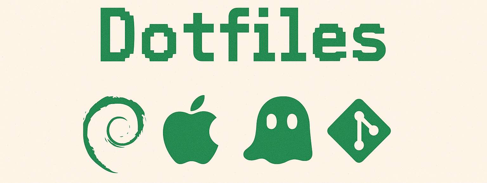

# .files

> [!NOTE]
> .files configuration and bootstrapping new machines.



## :rocket: Bootstrap

Bootstrapping will be idempotent and applicable to Debian Linux and macOS systems.

Depending on the availability of `curl` or `wget`, use one of the following commands:

```bash
bash -c "$(curl -fsSL https://raw.githubusercontent.com/n4tht4n/.files/main/remote-bootstrap)"
```

```bash
bash -c "$(wget -qO - https://raw.githubusercontent.com/n4tht4n/.files/main/remote-bootstrap)"
```

Basically, this will:

- check if a supported system is present (for now, either Debian or macOS)
- install some minimal tools (e.g. Git) to proceed
- install [Homebrew](https://brew.sh) (on both, Debian and macOS)
- install [chezmoi](https://www.chezmoi.io) to load and apply the rest of my .files (this repo)

## :convenience_store: chezmoi

I'm using [chezmoi](https://www.chezmoi.io) to create and execute some tool installations,
as well as managing their configuration files.

